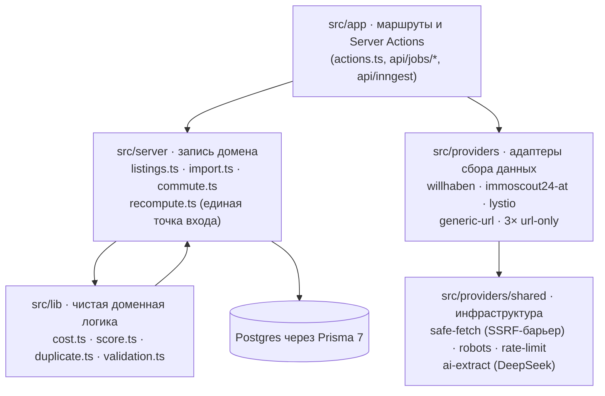

# AppScanner — анализ проекта

Полный обзор архитектуры, качества кода, логики, дизайна/UX, безопасности и покрытия тестами. Область: архитектура + качество, безопасность, тесты, логика приложения, дизайн. Глубина: полное чтение кода файл за файлом + живой обзор в браузере. Дата: 2026-08-03, ветка main.

## Резюме

AppScanner — качественно построенный, сознательно однопользовательский инструмент. Дисциплина в предметной области необычно сильна для проекта такого размера: паттерн из 11 денежных полей (сумма / уверенность / исходный текст) держит каждую финансовую цифру честной насчёт того, насколько она достоверна, единая точка входа `recomputeListing` владеет каждой записью стоимости/скоринга, а слой скрейпинга имеет корректно защищённый от TOCTOU SSRF-барьер. Обзор не нашёл **ни одной** эксплуатируемой уязвимости и **ни одного** нарушения двух самых жёстких правил целостности данных (единая точка пересчёта, единый Prisma-клиент).

Второй проход — уже вживую в браузере плюс чтение алгоритмов скоринга, стоимости, краулера, дедупликации, коммьюта и уведомлений — добавил пять новых находок: реальный баг на дашборде (виджет "Топ совпадений" молчит, хотя скоринг отработал на всех 117 листингах), потерю данных об изменениях в таймлайне листинга, отсутствие изоляции ошибок в пакетном пересчёте коммьюта, и пару более мелких пробелов в дедупликации и краулере. Плюс четыре небольших конкретных пробела в качестве кода из первого прохода — несогласованное проглатывание ошибки между двумя почти идентичными функциями, три Server Actions, возвращающие сырые Prisma-строки, и дублированная логика парсинга в трёх скрейпер-адаптерах — и пара мелких замечаний по безопасности, не требующих срочных действий.

| Метрика                          | Значение |
| -------------------------------- | -------- |
| Эксплуатируемых уязвимостей      | 0        |
| Замечаний по качеству кода       | 4        |
| Находок в логике и UX            | 5        |
| Мелких замечаний по безопасности | 2        |

## Архитектура

### Стек

Next.js 16 (App Router) · React 19 · Prisma 7 + adapter-pg · Postgres · Clerk auth · Inngest jobs · Zod · Cheerio · Playwright (скрейп + e2e) · AI SDK + DeepSeek · shadcn/ui (Base UI) · TanStack Query/Table · Tailwind v4 · Vitest

### Поток запроса

### Модель данных

**13 моделей**, **24 enum'а**. Ядро — `Listing`, несущая 11 _денежных полей_ — каждое как три плоские колонки (`{field}Amount` / `{field}Confidence` / `{field}SourceText`) вместо вложенной таблицы, управляемых сквозным кортежем `MONEY_FIELDS` в `src/server/listing-mapper.ts`. Уверенность никогда не повышается втихую: `EXACT`, `ESTIMATE` и `UNKNOWN` проходят весь путь от скрейпера → расчёта стоимости → скоринга, а AI-экстрактор схемой принуждён никогда не заявлять `EXACT`.

Второй паттерн, достойный внимания: `recomputePending` выставляется перед каждой записью стоимости/скоринга и снимается после, а cron-задача (`recoverPendingRecomputesJob`) подчищает всё, что застряло — осознанный самовосстанавливающийся дизайн для потока, способного упасть на полпути. Одно и то же разделение prod/dev повторяется в каждом тяжёлом Server Action: продакшен ставит событие Inngest в очередь, dev-режим выполняет работу синхронно.

| Адаптер                                 | Стратегия получения данных                 | Заметная деталь                                                                       |
| --------------------------------------- | ------------------------------------------ | ------------------------------------------------------------------------------------- |
| Willhaben                               | Реальный fetch + парсинг                   | Читает JSON-блок `__NEXT_DATA__` напрямую вместо CSS-скрейпинга                       |
| ImmoScout24 AT                          | Реальный fetch + парсинг                   | Сочетает JSON-LD с блоком состояния Apollo GraphQL; regex-фолбэк для старых страниц   |
| Lystio                                  | Реальный fetch + Playwright (только поиск) | Формат чисел английской локали — противоположный двум другим, свой собственный парсер |
| Immowelt AT / Der Standard / FindMyHome | Только URL, без fetch                      | Используют одну фабрику, `url-only-provider-factory.ts`                               |
| Generic URL                             | Реальный fetch + AI-фолбэк                 | Метаданные OG/JSON-LD, затем DeepSeek-экстракция для недостающего                     |

## Качество кода и соответствие конвенциям

| Правило из AGENTS.md                                | Статус          | Комментарий                                                                                                                      |
| --------------------------------------------------- | --------------- | -------------------------------------------------------------------------------------------------------------------------------- |
| Единая точка пересчёта (`recomputeListing`)         | ✅ Соблюдается  | Нет ни одного места записи `monthlyKnownCost`/`monthlyLikelyTotal`/`costRedFlags`/`ScoreBreakdown` вне `src/server/recompute.ts` |
| Единый `PrismaClient`                               | ✅ Соблюдается  | `new PrismaClient(` встречается ровно один раз, в `src/lib/db.ts`                                                                |
| Decimal никогда не пересекает границу Server→Client | ⚠️ 2 отклонения | См. находки ниже — сейчас без падений, но паттерн нарушен                                                                        |
| Никаких выдуманных значений полей                   | ✅ Соблюдается  | Обеспечивается в `cost.ts`, схема AI-экстрактора запрещает уверенность `EXACT`                                                   |

### Находки

**Тихий сбой пересчёта при создании листинга** — `src/server/listings.ts:273`
`createListingFromDraft` перехватывает неудачный вызов `recomputeListing` и вне продакшена не делает вообще ничего — ни лога, ни повторного throw. Почти идентичный блок в `updateListingFromDraft` (строка 334) корректно перебрасывает ошибку после постановки Inngest-фолбэка в очередь. Два близнеца-пути должны обрабатывать один и тот же сбой одинаково.

**Server Actions возвращают сырые Prisma-строки** — `src/app/actions.ts:29, 35, 88`
`importFromUrlAction`, `importFromEmailAction` и `addNoteAction` возвращают сырую строку `ImportJob`/`Note` вместо явной формы. Клиент принудительно приводит тип результата в `import-wizard.tsx`. Сегодня без Decimal-поля ничего не падает, но паттерн хрупкий в момент, когда любая из моделей получит колонку Decimal.

**Дублированная логика парсинга в адаптерах с реальным fetch** — `willhaben.ts` · `lystio.ts` · `immoscout24-at.ts`
`hostMatches`, цикл сканирования URL из email и `parseGermanDate`/`extractJsonLdGraph` скопированы во все три скрейпера с тонко расходящимися граничными случаями. Остальные три адаптера уже избегают этого через `url-only-provider-factory.ts`.

**Фрагмент AI-слияния дублирован между двумя адаптерами** — `generic-url.ts:33` · `email-alert-parsing.ts:40`
Оба новых места вызова AI-экстракции дословно повторяют одну и ту же логику фильтрации полей / spread / повторного разрешения, введённую в одном коммите.

### Что держится хорошо

Ноль комментариев `TODO`/`FIXME`/`HACK` и ноль использований `: any` где-либо в `src/`. Только два намеренных вызова `console.*` в продакшен-коде, оба — задокументированное логирование фолбэков. Большинство голых блоков `catch {}` явно прокомментированы как best-effort-паттерны. Одно осознанное упрощение честно помечено в `cost.ts` комментарием `ponytail:` (плоская эвристика €1500 на обустройство мебели).

## Логика приложения — глубокий разбор

Прочитаны целиком `score.ts` (скоринг), `cost.ts`, `crawler.ts` (краулер сохранённых поисков), `duplicate.ts` (дедупликация), `commute.ts` и `notifications.ts` (коммьют и Telegram-уведомления). В целом логика продумана и последовательно применяет принцип "неизвестное никогда не становится нулём" — но нашлось несколько мест, где обработка ошибок не дотягивает до планки, заданной остальным кодом.

**Пакетный пересчёт коммьюта не изолирует сбои** — `src/server/commute.ts:61`
`recalculateAllCommutes` идёт по всем листингам с координатами последовательно и на каждый делает отдельный вызов внешнего Google Distance Matrix API — без try/catch на уровне итерации. Если `computeCommute` бросит исключение на листинге N, весь цикл падает, и листинги N+1…конец в этом запуске вообще не обрабатываются, без частичного прогресса и без ретрая. Не соответствует паттерну устойчивости остального кода (самовосстановление `recomputePending`, постраничный try/catch в краулере).

**Guard краулера от параллельных запусков держится только в рамках одного процесса** — `src/server/crawler.ts:49`
Флаг `isRunning` — module-level переменная, защищающая только от повторного запуска внутри одного процесса. Комментарий в файле сам признаёт: дедупликация здесь — "read-then-write" без уникального ограничения в БД. Риск невысок для однопользовательского инструмента, но стоит держать в уме при переезде на многоинстансный деплой.

**Дедупликация по цене не откатывается на общий итог** — `src/lib/duplicate.ts:155`
Сравнение похожести по цене использует только `baseRentAmount` — если у листинга известен лишь `advertisedMonthlyTotal`, цена целиком выпадает из доказательной базы совпадения, алгоритм полагается только на комнаты + площадь.

### Что устроено хорошо

`score.ts`: жёсткие "hard violation" проверки намеренно завязаны на `monthlyKnownCost` — только на подтверждённую сумму, не на оценочную, так что листинг не обнуляется из-за неточной оценки. Ставка на mock-провайдер коммьюта искусственно ограничена 50% очков. `duplicate.ts`: чистая функция без обращений к БД, продуманная приоритизация совпадений (ID провайдера > URL > похожесть адреса+цены), нормализация URL/адреса (страссе/strasse/str., diacritics, UTM-параметры). `notifications.ts`: дедупликация через уникальный `dedupeKey` с переклеймом зависших `PENDING`/`FAILED` записей, плюс дневной лимит — устойчивый дизайн без явных дыр.

## Дизайн и UX — живой обзор

Просмотрены вживую (через dev-сервер) дашборд, список листингов, карточка листинга, импорт и настройки, плюс код ключевых компонентов. Общее визуальное качество высокое: спокойная типографика, последовательная система карточек/бейджей, необычно подробные и честные пояснительные тексты. Нашлась одна настоящая логическая нестыковка на дашборде и одна потеря данных в UI.

**Виджет "Топ совпадений" вводит в заблуждение при пустом результате** — `src/app/page.tsx:46`
Вживую: на дашборде с 117 отслеживаемыми листингами блок "Top matches" показывает "No scored listings yet. Import a listing to see matches here.", а "Avg. top-5 score" — прочерк. Это неверно: скоринг отработал на всех 117 листингах (лучший найденный — 77/100, статус Rejected; следующий — 73/100 при 66% полноты данных). Причина: `topMatches` требует одновременно `totalScore ≥ 70` **и** `dataCompleteness ≥ 70`, и в текущих данных ни один непроверенный листинг не проходит оба порога сразу. Условие само по себе разумное, но два момента вводят в заблуждение:

1. копия "No scored listings yet" звучит так, будто скоринга вообще не было;
2. ярлык "Avg. top-5 score" обещает "средний балл топ-5 листингов", а реально считает средний балл среди прошедших порог (максимум 5) — метрика показывает прочерк даже при реальных высоких баллах, если полнота данных чуть ниже 70%.

**Таймлайн листинга не показывает, что именно изменилось** — `src/components/listing-detail/timeline-section.tsx:4` · `src/server/listings.ts:320`
Вживую: карточка листинга с 7 обновлениями за неделю показывает 7 одинаковых строк "Refreshed from source." подряд. При этом `updateListingFromDraft` честно сохраняет в `ListingSnapshot.fields` значения до/после (например, `baseRentAmountBefore`/`baseRentAmountAfter`) — но тип `SnapshotVM` в `timeline-section.tsx` вообще не включает поле `fields`, так что эти данные до UI никогда не доходят.

### Что работает хорошо

Карточка листинга — образец информационной плотности без перегруза: полоски прогресса по каждой категории скоринга с текстовым обоснованием, явное разделение "известно" / "оценка" / "неизвестно" в финансовой разбивке, блок "Applied profile estimates" отдельной рамкой с пояснением. Страница настроек — образцовая honest-by-default копия ("Otherwise a clearly-labeled mock estimate is used — never a fabricated real result", источник дефолтов энергии подписан). Мастер импорта и подсказки по провайдерам пошагово и конкретно. Тёмная/светлая тема, i18n-переключатель EN/RU в сайдбаре, консистентный набор бейджей статуса.

## Покрытие тестами

Пробел, достойный внимания: ни один тест не проверяет описанный выше тихий catch в `listings.ts:273` — случай, где тест, скорее всего, поймал бы асимметрию с соседней функцией ещё до релиза.

| Слой                   | Где                                                             | Покрывает                                                                                                                                        |
| ---------------------- | --------------------------------------------------------------- | ------------------------------------------------------------------------------------------------------------------------------------------------ |
| Unit — доменная логика | `src/lib/__tests__/`                                            | cost (15 кейсов), score (10), duplicate (9), validation (8), commute-rating (5), search-profile (4), telegram (2), env (1+3)                     |
| Unit — провайдеры      | `src/providers/**/*.test.ts`                                    | Каждый адаптер плюс общая инфраструктура: safe-fetch, fetch-html, remote-fetch, text-signals, новые AI-пути `ai-extract` / `email-alert-parsing` |
| Unit — сервер/роутинг  | `listing-mapper.test.ts`, `proxy.test.ts`, `job-routes.test.ts` | Маппинг денежных полей, middleware авторизации, 404-в-проде для dev-маршрутов                                                                    |
| Интеграционные         | `src/server/listings.integration.test.ts`                       | 5 кейсов против реальной БД, запускаются отдельно через `test:integration`                                                                       |
| E2E                    | `e2e/*.spec.ts`                                                 | Сравнение листингов, фильтрация, ручной импорт, мобильная раскладка, смена статуса, скан доступности                                             |

## Безопасность

Ни одной подтверждённой эксплуатируемой уязвимости во всей проверенной поверхности.

**SSRF-барьер перепроверяет адрес в момент подключения** — `src/providers/shared/safe-fetch.ts`
Приватные/loopback/link-local/зарезервированные диапазоны IPv4 и IPv6 отклоняются, и кастомный колбэк DNS `lookup` перепроверяет resolved-адрес в момент TCP-подключения — закрывает дыру DNS-rebinding. Редиректы ограничены, каждый переход перепроверяется; размер ответа и таймаут ограничены.

**Авторизация применяется последовательно** — `src/proxy.ts` · `src/server/current-user.ts`
Middleware Clerk защищает каждый маршрут, кроме страницы входа и вебхука Inngest (авторизует себя сам через signing key). `getCurrentUser()` ограничивает доступ одним захардкоженным email владельца, dev-only маршруты возвращают 404 в продакшене.

**Prompt injection реальна, но локализована** — `src/providers/shared/ai-extract.ts`
Текст со страницы попадает в промпт DeepSeek без санитизации. Воздействие ограничено: строгая Zod-схема разрешает только `ESTIMATE`/`UNKNOWN`, извлечённые поля лишь заполняют черновик для ручного просмотра, ничего не запускает дальнейшие действия.

| Пункт                                    | Где                         | Почему не приоритет                                                                   |
| ---------------------------------------- | --------------------------- | ------------------------------------------------------------------------------------- |
| Схема env использует `.passthrough()`    | src/lib/env.ts:61           | Молча принимает будущие непровалидированные переменные — легко забыть валидацию позже |
| Нет ограничения длины поискового запроса | src/app/api/search/route.ts | Эндпоинт только для владельца, `take: 8` уже ограничивает результат                   |

Захардкоженных секретов не найдено. `.env` корректно в gitignore; `.env.example` содержит только плейсхолдеры.

## Рекомендации

| #   | Приоритет | Что                                                                                                      | Где                                                    |
| --- | --------- | -------------------------------------------------------------------------------------------------------- | ------------------------------------------------------ |
| 1   | **P1**    | Исправить копию и метрику виджета "Топ совпадений"                                                       | `src/app/page.tsx:46-99`                               |
| 2   | **P1**    | Исправить асимметрию тихого catch в `createListingFromDraft`                                             | `src/server/listings.ts:273`                           |
| 3   | **P2**    | Изолировать сбои внутри `recalculateAllCommutes` (try/catch на итерацию)                                 | `src/server/commute.ts:61`                             |
| 4   | **P2**    | Возвращать явные формы из трёх Server Actions с сырыми строками                                          | `src/app/actions.ts:29,35,88`                          |
| 5   | **P2**    | Прокинуть `fields` из снапшота в таймлайн                                                                | `src/components/listing-detail/timeline-section.tsx:4` |
| 6   | **P3**    | Вынести дублированные хелперы адаптеров в общий модуль                                                   | `willhaben.ts` / `lystio.ts` / `immoscout24-at.ts`     |
| 7   | **P3**    | Вынести общий AI-merge helper                                                                            | `generic-url.ts:33`, `email-alert-parsing.ts:40`       |
| 8   | **P3**    | Дать дедупликации откат на `advertisedMonthlyTotal`                                                      | `src/lib/duplicate.ts:155`                             |
| 9   | **P4**    | Ужесточить схему env по мере роста (убрать `.passthrough()`)                                             | `src/lib/env.ts:61`                                    |
| 10  | **P4**    | Заменить module-level `isRunning` на межпроцессный guard — только при переходе на многоинстансный деплой | `src/server/crawler.ts:49`                             |

---

_Обзор без изменений кода — файлы проекта не модифицированы. HTML-версия с диаграммами и цветовой разметкой опубликована как Artifact._
